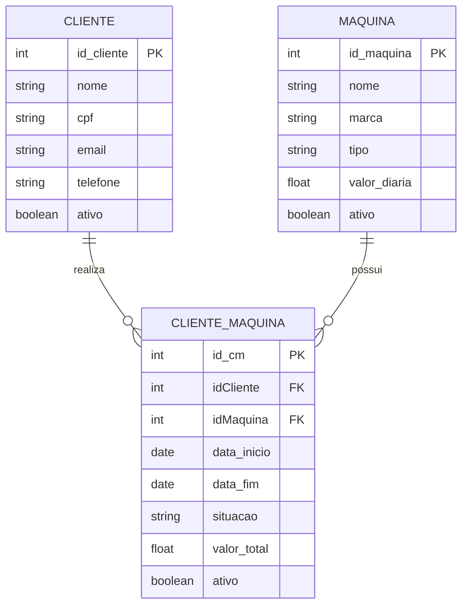

# Paradigma_Maquinario

# Maquinario

## 💡 Visão Geral do Projeto

### Contexto
Projeto de aplicação web voltado para o aluguel de maquinarios de contrução
* o sistema visa facilitar o encontro de construtoras com donos de maquinários.

### 🛠️ Ferramentas Usadas

| Camada | Tecnologia |
| :--- | :--- |
| **Frontend** | React + JavaScript + Tailwind + Vite |
| **Backend** | Java + SpringBoot |
| **Banco de Dados** | MySQL |
| **Autenticação** | Spring Security (a ser implementado) |

---

## 🎯 Objetivos

* Agilizar e aprimorar os processos de agendamento e alugueis.
* Criar uma ferramenta prática para o dia-a-dia
* Facilitar a visualização e criação de relatórios para os gestores.

---

## 📋 Especificações (Escopo)

O sistema deve incluir as seguintes funcionalidades:

* **Listagem de Maquinas/clientes/transações:** Visualização em lista por formato de cartelas (cards).
* **Disponibilidade:** Visualização da disponibilidade.
* **Relatórios:** Controle e facilitação na geração de relatórios para o comprador.

---

## ⚠️ Problemas Atuais (Resolvidos pelo Projeto)

* A falta de comunicação entre os sistemas utilizado por eles. apenas o back e o banco estão em comunicação

## Directory Structure
Frontend:
 
Backend:
- `/src` : codigo fonte
  - `/controller`: controllers de serviço
  - `/domain`: `/dtos` : todos os Dtos do sistema, dividido em request e response
  - `/domain`: `/dtos` :`/request`: esquemas de dtos de ponto de pedido http (entrada de dados)
  - `/domain`: `/dtos` :`/response`: esquemas de dtos de ponto de pedido http (saida de dados)
  - `/domain`: `/entity` : todos os esquemas de entidades
  - `/infra` : infraestrutura do sistema
  - `/infra`: `/cofig` : configurações e segurança
  - `/infra` : `/mapper` : logica de encapsulamento e transformação de dto(request) para entidade e entidade para dto (response)
  - `/infra` : `/repository` : repositorios das entidades e ponto de acesso ao banco
  - `/infra` : `/service` : camada de interface e implementação das interfaces para encapsular os metodos dos controllers
  - `/infra` : `/validate` : camada de validação para o fluxo de informação

### Limitações Conhecidas
- Não há autenticação de usuário

## Database Schema

## API Endpoints
- `/dtoRequests`: entrada de dados json
  - `/Cliente`:{
                "nome": "string",
                "cpf": "string",
                "email": "string",
                "telefone": 0
    }
  - `/ClienteMaquina`:{ 
                "cliente": 0,
                "maquina": 0,
                "dataInicio": "2026-05-24T19:28:11.169Z",
                "dataFim": "2026-05-24T19:28:11.169Z",
                "situacao": "string",
                "valorTotal": 0.1
 }
  - `/Maquina`:{  
                "nome": "string",
                "marca": "string",
                "tipo": "string",
                "valor_Diaria": 0.1

}
